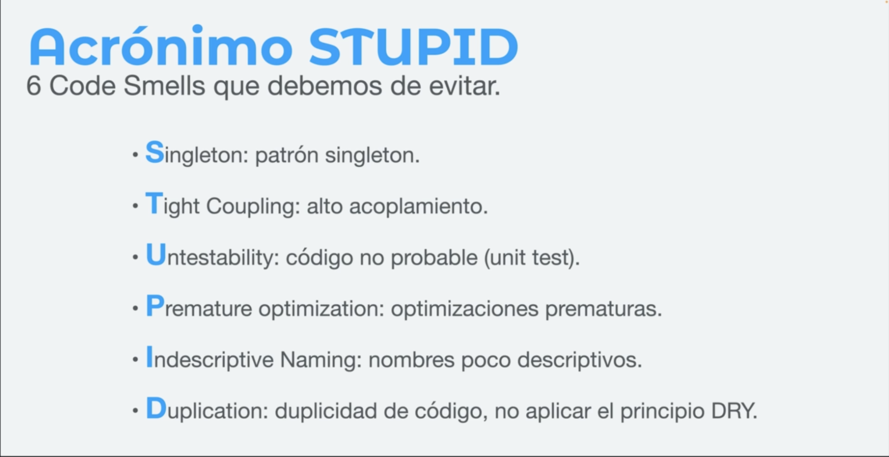
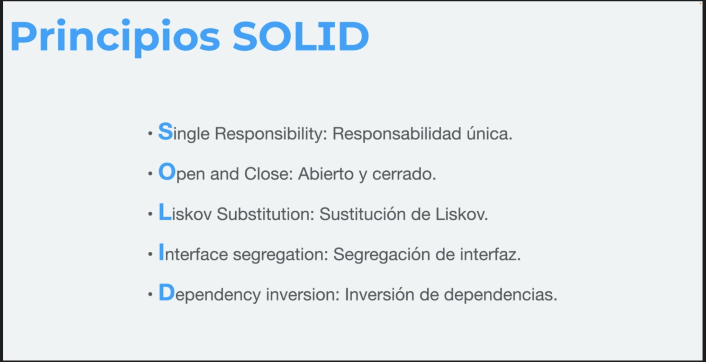

# Proyecto para practicar

Este es un proyecto de Vanilla TypeScript en Vite, para trabajar los ejercicios del curso sobre Principios SOLID y CleanCode.

Clonar o descargar el proyecto y luego:

```
yarn install
ó
npm install
```

Para ejecutar el proyecto, simplemente ejecuten
```
yarn dev
ó
npm run dev
```

# Citas


`"Código limpio es aquel que se ha escrito con la intención de que otra persona (o tú mismo en el futuro) lo entienda."`
_Carlos Blé_


`"Nuestro código tiene que ser simple y directo, debería leerse con la misma facilidad que un texto bien escrito."`
___Grady Booch___


`"Programar es el arte de decirle a otro humanao lo que la quieres que la computadora haga."`
___Donald knuth___


`"Sabemos que estamos desarrollando código limpio cuando cada función hace exactamente lo que su nombre indica."`
___Ward Cunningham___


`"Si quieres ser un programador productivo esfuérzate en escribir código legible."`
___Robert C. Martin___


`"El buen código parece estar escrito por alguien a quien le importa."`
___Michael Feathers___


`"No comentes el código mal escrito, reescríbelo."`
___Brian W. Kernighan___


`"Queremos diseñar componentes que sean autocontenidos, auto suficientes e independientes. Con un objetivo y un propósito bien definido."`
___The Pragmatic Programmer___

# Principio de diseño de software

### DRY (Seco)

El principio ***No te repitas*** (en inglés ___Don't Repeat Yourself___ o ***DRY***, también conocido como ***Una vez y sólo una***) es una filosofía de definición de procesos que promueve la reducción de la duplicación especialmente en computación. Según este principio toda "pieza de información" nunca debería ser duplicada debido a que la duplicación incrementa la dificultad en los cambios y evolución posterior, puede perjudicar la claridad y crear un espacio para posibles inconsistencias.

### STUPID 



### Olores honorificos

 - Inflación: métodos con más de 10 líneas -> segmentar en varios métodos más pequeños.
    Clases con muchas funciones, misma solución.
 - Obsesión primitiva: gran cantidad de primitivos -> usar un objeto
 - Lista larga de parámetros: +3/4 de argumentos en un métodos -> comprobar que los valores son reqqueridos
 - Acopladores:
   - feature envy: llama a más información de otra clase más que a sus mismos datos.
   - intimidad inapropiada: clase usa campos internos de otra clase
   - cadena de mensajes: función A, que llama a B, que llama C y asi sucesívamente. -> que A llama directamente a Z
   - The middle man: clase realiza una sola acción y delega el resultado a otra


___fuente___ [refactoring.guru](https://refactoring.guru)


# SOLID (Sólido)

Los __5 principios S.O.L.I.D.__ de diseño de software son:





S – Single Responsibility Principle (SRP)


`"Nunca debería haber más de un motivo por el cual cambiar una clase o módulo."`
___Robert C. Martin___

```
"tener una única responsabilidad" !== "hacer una única cosa"
```
##### Detectar Violaciones
 - Nombres de clases y módulos demasiado genéricos.
 - Cambios en el código suelen afectar la clase o módulo.
 - La clase involucra múltiples capas.
 - Número elevado de importaciones.
 - Cantidad elevada de métodos públicos.

O – Open/Closed Principle           (OCP)

L – Liskov Substitution Principle   (LSP)

I – Interface Segregation Principle (ISP)

D – Dependency Inversion Principle  (DIP)

